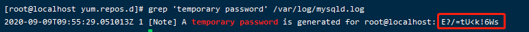

# Python 全栈文档

## 第十二章  Linux安装MySQL

1、下载并安装MySQL官方的 Yum Repository

​        由于CentOS 的yum源中没有mysql，需要到mysql的官网下载

centos7就是Red Hat Enterprise linux7，选择这个版本的mysql就行。


  2、然后进行rpm的安装

​      rpm -ivh mysql-community-server-xxxx

​      *1  .rpm -e mariadb-libs --nodeps 卸载一个软件包（库被占用）*

*2  .先安装mysql-community-common-8.0.21-1.el7.x86_64.rpm*

rpm -ivh mysql-community-libs-8.0.21-1.el7.x86_64.rpm

rpm -ivh mysql-community-client-8.0.21-1.el7.x86_64.rpm

rpm -ivh mysql-community-server-8.0.21-1.el7.x86_64.rpm

3、使用yum命令安装依赖：net-tools

   

```bash
[root@localhost yum.repos.d]#   yum install net-tools

```

4、启动MySQL/重启
[root@master software]# service mysql start
[root@master software]# service mysql restart
```bash
3  .mysqld --initialize 先初始化

cd /var/lib/mysql mysql的安装地址
在此地址下输入chown mysql:mysql mysql -R，将mysql用户从root改为mysql，-R表递归改动还是报错
由上面的异常可以看到data file ‘ibdata1’ must be writable说明当前是不可写的数据文件，看来是因为权限不足，通过以下命令授权
输入chown -R mysql:mysql /var/lib/mysql

[root@localhost yum.repos.d]#  systemctl start mysqld.service ：mysql安装后已经注册为系统服务
# mysql要通过系统服务来启动，一般默认服务名是mysqld
systemctl status mysqld.service查看mysql状态，running就是启动中
systemctl stop mysqld.service关闭mysql服务
```

5、获取安装时的临时密码（在第一次登录时就是用这个密码）

密码在 cd /var/log<font color='red'>/mysqld.log</font>，在目录下看到这个文件的<font color='red'>创建者是mysql，用户组也是mysql</font>。此文件就是mysql运行时产生的日志文件

mysql在运行时有个专有的用户mysql,不能通过linux远程登录，只能运行mysql服务器。

-rw-r-----. 1 mysql  mysql     457 5月  25 16:02 mysqld.log

```bash
[root@localhost yum.repos.d]4  # grep 'temporary password' /var/log/mysqld.log
2020-09-09T09:55:29.051013Z 1 [Note] A temporary password is generated for root@localhost: Qx-lU0=jJRwr
```



6、登录mysql

第一次登陆失败报错：ERROR 1045 (28000): Access denied for user 'root'@'localhost' (using password: YES)

干脆第一次设置空格密码登陆（不要密码）

使用 vi /etc/my.cnf 命令进入配置文件，然后在末尾加入 skip-grant-tables语句，保存并退出该文件，systemctl stop mysqld.service关闭mysql服务，再重新开启，登陆。键入密码时直接按enter就行。

克隆系统后初始密码一次登陆成功

```bash
[root@localhost yum.repos.d]# mysql -u root -p
Enter password: 
Welcome to the MySQL monitor.  Commands end with ; or \g.
Your MySQL connection id is 5
Server version: 5.7.31

Copyright (c) 2000, 2020, Oracle and/or its affiliates. All rights reserved.

Oracle is a registered trademark of Oracle Corporation and/or its
affiliates. Other names may be trademarks of their respective
owners.

Type 'help;' or '\h' for help. Type '\c' to clear the current input statement.

mysql> 


# 注意密码这里没有回显
```

7、登录后修改密码

```
注意：这里会进行密码强度校验（密码设置时必须包含大小写字母、特殊符号、数字，并且长度大于8位）
而且建议使用强口令，特别是从事商业开发项目，养成这个习惯比较好
```

```bash
mysql> alter user 'root'@'localhost' identified by 'fasttext77';
Query OK, 0 rows affected (0.00 sec)
```

8、验证密码

设置随机启动：systemctl enable mysqld.service

取消随机启动：systemctl disable mysqld.service

```bash
mysql> exit，也可以\q退出
Bye

[root@localhost yum.repos.d]# mysql -u root -p
Enter password: 
Welcome to the MySQL monitor.  Commands end with ; or \g.
Your MySQL connection id is 7
Server version: 5.7.31 MySQL Community Server (GPL)

Copyright (c) 2000, 2020, Oracle and/or its affiliates. All rights reserved.

Oracle is a registered trademark of Oracle Corporation and/or its
affiliates. Other names may be trademarks of their respective
owners.

Type 'help;' or '\h' for help. Type '\c' to clear the current input statement.

mysql>
```

