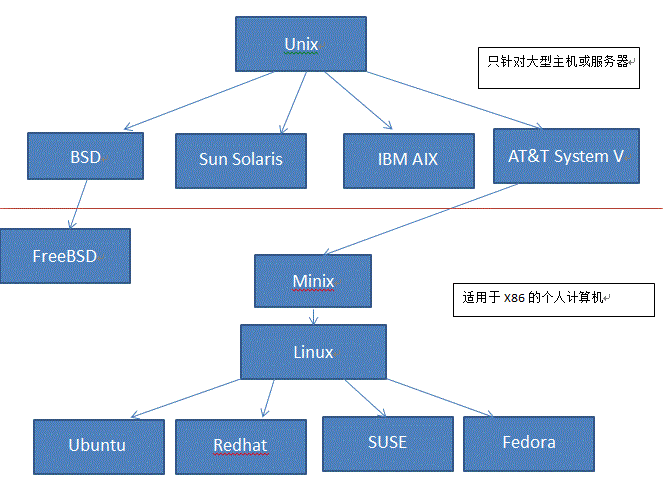

# Python 全栈文档

## 第一章 Linux概述

#### 1、操作系统

​    定义：操作系统(Operating System，简称OS)是管理计算机硬件与软件资源的计算机程序

​    作用：是把计算机系统中对硬件设备的操作封装起来，供应用软件调用，也是提供一个让用户与系统交互的操作界面。


​    在我们的常见的操作系统中有

​    **PC端的**

​        1、Windows


​        2、MacOS


​        3、Linux


​    **移动端OS**

​        1、安卓与苹果


#### **2、操作系统的发展史**

​    **Unix**

​    1965年之前的时候，电脑并不像现在一样普遍，它可不是一般人能碰的起的，除非是军事或者学院的研究机构，而且当时大型主机至多能提供30台终端（30个键盘、显示器)，连接一台电脑


​    为了解决数量不够用的问题

​    1965年左后由贝尔实验室、麻省理工学院 以及 通用电气共同发起了Multics项目，想让大型主机支持300台终端

​    1969年前后这个项目进度缓慢，资金短缺，贝尔实验室退出了研究

​    1969年从这个项目中退出的Ken Thompson当时在实验室无聊时，为了让一台空闲的电脑上能够运行“星际旅行”游行，在8月份左右趁着其妻子探亲的时间，用了1个月的时间 编写出了 Unix操作系统的原型

​    1970年，美国贝尔实验室的 Ken Thompson，以 BCPL语言 为基础，设计出很简单且很接近硬件的 B语言（取BCPL的首字母），并且他用B语言写了第一个UNIX操作系统。

​    因为B语言的跨平台性较差，为了能够在其他的电脑上也能够运行这个非常棒的Unix操作系统，Dennis Ritchie和Ken Thompson 从B语言的基础上准备研究一个更好的语言

​                                                         肯·汤普逊（左）和丹尼斯·里奇（右）


​    1972年，美国贝尔实验室的 Dennis Ritchie在B语言的基础上最终设计出了一种新的语言，他取了BCPL的第二个字母作为这种语言的名字，这就是C语言

​    1973年初，C语言的主体完成。Thompson和Ritchie迫不及待地开始用它完全重写了现在大名鼎鼎的Unix操作系统

​    早期的Unix系统都是针对专门的硬件系统开发的，不同厂商都是为自己的服务器开发专门的Unix操作系统。

​    **Minix**

​    因为AT&T(通用电气)的政策改变，在Version 7 Unix推出之后，发布新的使用条款，将UNIX源代码私有化，在大学中不再能使用UNIX源代码。Andrew S. Tanenbaum(塔能鲍姆)教授为了能在课堂上教授学生操作系统运作的实务细节，决定在不使用任何AT&T的源代码前提下，自行开发与UNIX兼容的操作系统，以避免版权上的争议。他以小型UNIX（mini-UNIX）之意，将它称为MINIX。

​    **Linux**

​    因为Minix只是教学使用，因此功能并不强，因此Torvalds利用GNU的bash当做开发环境，gcc当做编译工具，编写了Linux内核-v0.02，但是一开始Linux并不能兼容Unix，即Unix上跑的应用程序不能在Linux上跑，即应用程序与内核之间的接口不一致，因为Unix是遵循POSIX规范的，因此Torvalds修改了Linux，并遵循POSIX（Portable Operating System Interface，他规范了应用程序与内核的接口规范）； 一开始Linux只适用于386，后来经过全世界的网友的帮助，最终能够兼容多种硬件；


​    Minix最有名的学生用户是Linus Torvalds，他在芬兰的赫尔辛基大学用Minix操作平台建立了一个新的操作系统的内核，他把它叫做Linux。

​    Linux内核最初只是由***\**\*芬兰\*\**\******\**\*人林纳斯·托瓦兹（Linus Torvalds）\*\**\***在赫尔辛基大学上学时出于个人爱好而编写的。

​    Linux是一套免费使用和自由传播的类Unix操作系统，是一个基于POSIX和UNIX的多用户、多任务、支持多线程和多CPU的操作系统

​    Linux能运行主要的UNIX工具软件、应用程序和网络协议。它支持32位和64位硬件。Linux继承了Unix以网络为核心的设计思想，是一个性能稳定的多用户网络操作系统。

​    目前市面上较知名的发行版有：Ubuntu、RedHat、CentOS、Debain、Fedora、SuSE、OpenSUSE。




​    Unix与Linux区别

​        Linux和UNIX的最大的区别是，**前者是开放源代码的自由软件，而后者是对源代码实行知识产权保护的传统商业软件**。
​        这应该是他们最大的不同，这种不同体现在用户对前者有很高的自主权，而对后者却只能去被动的适应；这种不同还
​        表现在前者的开发是**处在一个完全开放的环境之中,而后者的开发完全是处在一个黑箱之中,只有相关的开发人员才能 够接触的产品的原型** 。
​        具体区别如下：

```Linux
UNIX系统大多是与硬件配套的，而Linux则可运行在多种硬件平台上.
UNIX是商业软件，收费，而Linux是自由软件，免费、公开源代码的.
Linux商业化的有RedHat Linux 、SuSe Linux、slakeware Linux、国内的红旗等，还有Turbo Linux.
Unix主要有Sun 的Solaris、IBM的AIX,　HP的HP-UX，以及x86平台的的SCO Unix/Unixware.
```

#### 3、Linux发行版本

​        内核(kernel)是系统的心脏，是运行程序和管理像磁盘和打印机等硬件设备的核心程序，它提供了一个在裸设备与应用程序间的抽象层。

​        Linux内核版本又分为稳定版和开发版，两种版本是相互关联，相互循环：

```
- 稳定版：具有工业级强度，可以广泛地应用和部署。新的稳定版相对于较旧的只是修正一些bug或加入一些新的驱动程序。
- 开发版：由于要试验各种解决方案，所以变化很快。
```

​        内核源码网址：http://www.kernel.org 所有来自全世界的对Linux源码的修改最终都会汇总到这个网站，由Linus领导的开源社区对其进行甄别和修改最终决定是否进入到Linux主线内核源码中。

​        Linux发行版 (也被叫做 GNU/Linux 发行版) 通常包含了包括桌面环境、办公套件、媒体播放器、数据库等应用软件。

| 排行 | 版本              | 描述                                               |
| ---- | ----------------- | -------------------------------------------------- |
| 1    | **MX Linux**      | **基于Debian和antiX**                              |
| 2    | **Linux Mint**    | **基于Ubuntu和Debian**                             |
| 3    | **Ubuntu**        | **顶级Linux发行版之一**                            |
| 4    | **Elementary OS** | **基于Debian**                                     |
| 5    | **Manjaro Linux** | **基于Arch Linux**                                 |
| 6    | **Zorin OS**      | **基于Debian**                                     |
| 7    | **Fedora**        | **软件技术方面处于领先地位**                       |
| 8    | **Debian**        | **设计得非常稳定**                                 |
| 9    | **CentOS**        | **基于Fedora和Red Hat的企业最佳Linux**，就是redhat |
| 10   | **Kali Linux**    | **基于Debian**                                     |

cat /etc/redhat-release 查看CentOS版本，本系统是centos 7.9 2009

```
        Linux能做什么？

        Linux可作为企业级服务器，或嵌入式开发平台也包含个人桌面系统。包含虚拟化、数据库服务器、Web服务器、开发平台等等
```

```
        哪些人要学习Linux？

        Linux管理员，oracle管理员，网络工程师，程序开发者等等。Linux系统涉及方面非常广泛，生态也越来越强大，非常适合大家学习
```

​    **个人桌面领域的应用**

​        此领域是传统linux应用最薄弱的环节，传统linux由于界面简单、操作复杂、应用软件少的缺点，一直被windows所压制，但近些年来随着ubuntu、fedora等优秀桌面环境的兴起，同时各大硬件厂商对其支持的加大，linux在个人桌面领域的占有率在逐渐的提高

```
典型代表：ubuntu、fedora、suse linux
```

​    **服务器领域**

​        linux在服务器领域的应用是其重要分支

​        linux免费、稳定、高效等特点在这里得到了很好的体现，但早期因为维护、运行等原因同样受到了很大的限制，但近些年来linux服务器市场得到了飞速的提升，尤其在一些高端领域尤为广泛

```
典型代表： Red Hat公司的AS系列
          完全开源的debian系列
          suse EnterPrise 11系列等
```

​    **嵌入式领域**

​        近些年来linux在嵌入式领域的应用得到了飞速的提高

​        linux运行稳定、对网络的良好支持性、低成本，且可以根据需要进行软件裁剪，内核最小可以达到几百KB等特点，使其近些年来在嵌入式领域的应用得到非常大的提高

```
小贴士：Minix没有火起来的原因

Andrew Tanenbaum教授在发布Minix3时，接受采访时他透露MINIX3将移植到ARM架构。他说，MINIX3没有统治世界是源于他在1992年犯下的一个错误，当时他认为BSD必然会一统天下，因为它是一个更稳定和更成熟的系统，其它操作系统难以与之竞争。

因此他的MINIX的重心集中在教育上。四名BSD开发者已经成立了一家公司销售BSD系统，他们甚至还有一个有趣的电话号码1-800-ITS-UNIX。

然而他们正因为这个电话号码而惹火上身。美国电话电报公司因电话号码而提起诉讼。

官司打了三年才解决。在此期间，BSD陷于停滞，而Linux则借此一飞冲天。

 他的错误在于没有意识官司竟然持续了如此长的时间，以及BSD会因此受到削弱。如果美国电话电报公司没有起诉，Linux永远不会流行起来，BSD将统治世界。
```

