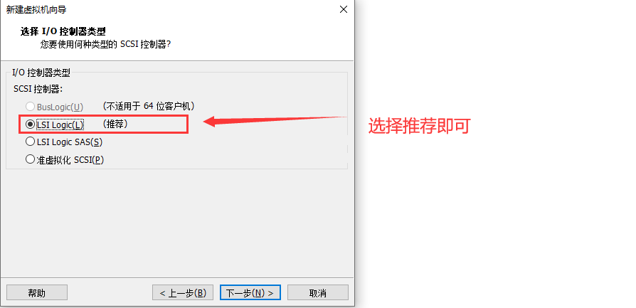
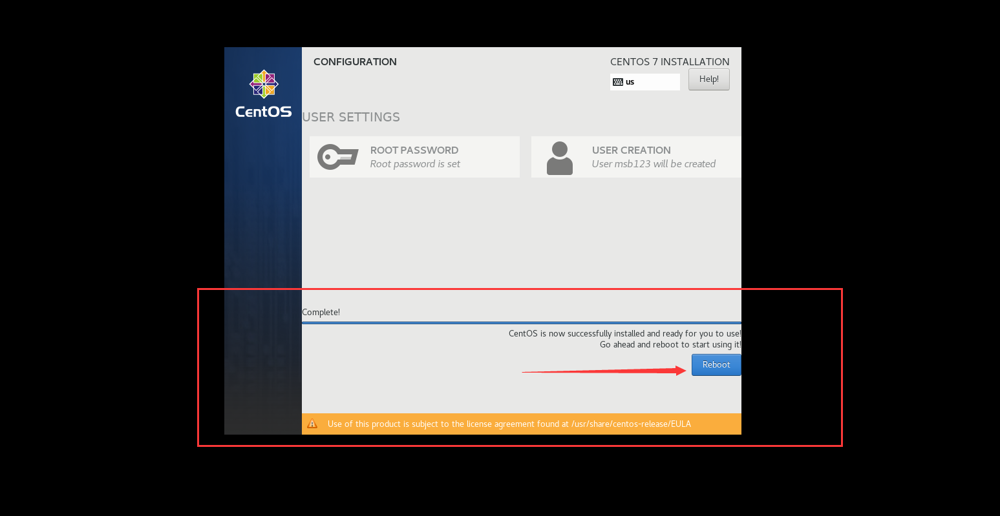
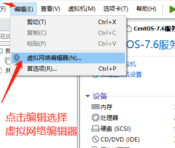
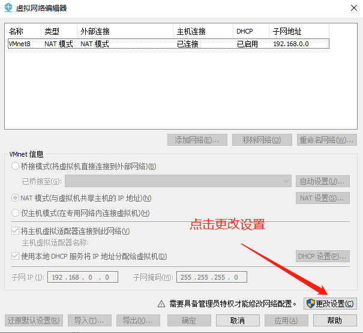

# Python 全栈文档

#### 1、安装VMware

​    这里安装Vm主要是为了安装Linux系统，除了相对云服务器，比较大众化的操作，当然更多的是熟悉Linux操作

   **1、Windows安装**

​    (1) 下载链接，目前版本上下载VM15的版本即可https://www.vmware.com/products/workstation-pro/workstation-pro-evaluation.html

​          选择for Windows点击下载

​    

​    (2) 双击打开安装包进行安装,点击下一步


​    (3) 勾选，接受协议

​         点击下一步


​    (4) 更改自己的安装位置，一般默认存在C盘，如果需要更改可以换成其他的盘符，我换成自己新建的文件夹

​         勾选增强型键盘驱动程序，点击下一步


​    (5) 全部勾选，这里勾选自行选择即可。然后点击下一步


​    (6) 这里就是自定义快捷方式，建议都勾选，打开也方便


​    (7)  点击安装


​    (8)  正在安装


​    (9)  点击完成


（注意：许可证为激活，建议安装正版）

​    (9)  安装成功后，会有提示是否需要重启电脑，这里先点击否

​          我们需要先检查一下电脑是否开启虚拟化，右键电脑最下方的任务栏，选择任务管理器


​    (10)  点击性能，选择CPU 查看到虚拟化这里显示已禁用

​            如果是空白或者显示已启用可以直接跳过直接去到[Linux安装]()


​    (11) 虚拟化显示禁用的可以，尝试先将电脑关机，接着开机后显示logo图标按ESC或者F1键，进入BIOS界面，

​            进入BIOS后选择Security  →  选择VIrtualization 虚拟化功能设置，

​            这里的翻译不用管，找到对应的选项即可

​         （这里是联想笔记本）不同主板显示不同，可以百度搜索熟悉详细信息


​            接着上下箭头按钮指向Intel(R) Virtualization Technology  [DIsabled]

​            将这里的DIsabled修改为Enabled，选择好后回车，接着按F10 Yes 保存即可


​    (11)重启后查看虚拟化显示已启用即可


#### 2、配置安装系统环境

​            这里Linux我们使用发行版的Centos7.6版本

​            简单介绍一下Centos：

​            

```
    CentOS 是一个基于Red Hat Linux 提供的可自由使用源代码的企业级Linux发行版本。每个版本的 CentOS都会获得十年的支持（通过安全更新方式）。新版本的 CentOS 大约每两年发行一次，而每个版本的 CentOS 会定期（大概每六个月）更新一次，以便支持新的硬件。这样，建立一个安全、低维护、稳定、高预测性、高重复性的 Linux 环境。CentOS是Community Enterprise Operating System的缩写。

    CentOS 是RHEL(Red Hat Enterprise Linux)源代码再编译的产物，而且在RHEL的基础上修正了不少已知的 Bug ，相对于其他 Linux 发行版，其稳定性值得信赖
```

​            如果有想尝试其他的Linux系统，可以模仿类似的操作完成其他类型的系统安装

​    (1) 首先先获取Centos的镜像文件

​            我们可以去官方界面操作，根据官方的文档树，下载镜像文件

​            打开官方连接http://vault.centos.org/

​            进入CentOS下载官网，找到CentOS7.6版本

​            找到文档树，选择7.6版本


​            选择isos


​            选择x86_64


​            选择[CentOS-7-x86_64-DVD-1708.iso](http://vault.centos.org/7.4.1708/isos/x86_64/CentOS-7-x86_64-DVD-1708.iso)下载


​            （注意如果有跳到如图下方这个界面，这里面选择第一个即可，剩下的也是相同的操作）


​    (2) 开始配置安装服务器打开VMware Workstation Pro软件

​         接着选择文件点击新建虚拟机


​    (3) 选择自定义，点击下一步


​    (4) 默认选择Workstation15.x，点击下一步


​    (5) 选择稍后安装操作系统，点击下一步


​    (6) 选择Linux  版本选择Centos 7 64 位


​    (7) 虚拟机名称自定义

​         位置自定义选择

​         点击下一步


​    (8) 处理器选择根据自己的电脑硬件的处理选择，

​        我这里选择 2处理器      每个处理器1内核


​        如何查看自己电脑的处理器情况信息尼

​        键盘上Windows图标+R键


​        在运行界面输入msinfo32，点击确定


​        处理器显示提示为2个内核 4个逻辑处理器


​    (9) 修改内存，内存这里的话1G也够用了，不需要太多

​          如果电脑是8G内存，虚拟机可以选择3G或者4G

​          如果电脑是4G内存，虚拟机可以选择1G或者2G

​          无论多大多小的内存，1G至4G的范围即可。


​    (10) 网络这里存在一些可选择区分，我们先选择NAT即可。


​    (11) 这里选择推荐即可



​    (12) 选择SCSI 


​    (13) 选择创建虚拟磁盘


​    (14) 这里 磁盘容量为50G，选择 将磁盘拆分成多个文件

​           说明一下一般40G就可以了，当然这是我们测试服务的情况运用学习

​           将文件拆分成多个文件


​    (15) 磁盘文件明辰及存储位置，一般我们前面设置了安装位置，默认即可不用修改


​    (16) 这里面如果之前有哪里写的不对或者写的存在一些问题，可以自定义修改文件，点击完成


#### 3、安装Centos系统

```
安装注意事项，安装的时候虚拟机 与 宿主机 (宿主机指当前虚拟机安装在本地环境上的设备)键盘操作切换

当在虚拟机系统内输入内容时，需要退出来，可以使用同时按住Ctrl+Alt，将鼠标退出虚拟机

可以使用鼠标单击进入虚拟机
```


​    (1) 点击编辑虚拟机设置   →  选择CD/DVD  →  使用ISO映像文件

​         这里的映像文件就是我们从官方网站的文档树下载下来的ISO文件


​    (2) 点击开启此虚拟机


​    (3) 在打开的界面第一次会这样显示

​         这里有一些选项，可以使用上下方向键进行移动选择位置，显示为白色的表示选中状态。

```
Install CentOS 7   
安装CentOS 7

Test this media & install CentOS 7
测试此应用并安装CentOS 7

Press Tab for full configuration options on menu items
按Tab键查看菜单项上的完整配置选项
```


​    (4) 这里可以选择按 ENTEN 或者不操作也可以，会自动安装


​        如下正在配置界面


​    (4) 这里建议选择English，点击Continue


​    (4) 这里面我们需要看一下基本的配置操作

```
LOCALIZATION
本地化

DATE & TIME                               KEYBOARD
时间和日期                                 键盘

LANGUAGE SUPPORT
语言

以上除了时间和日期，其他的可以不用操作


SOFTWARE
软件

INSTALLTION SOURCE                        SOFTWARE SELECTION
安装来源                                   安装软件选择

以上除了安装软件选择其他可以不用操作
```


```
点击  DATE & TIME 进入设置时区时间，我们选择回亚洲上海，设置好时间后，点击DONE保存
```


```
这里列出一些

Minnimal install                                      Debugging Tools
最小化安装                                             調式工具
基本功能                                               用于调试行为异常的应用程序和诊断性能问题工具

Compute Node                                          Compatibility Libraries
计算节点                                               兼容性库
计算处理装置                                           用于在CentOS Linux早期版本上构建的应用程序兼容性库

Infrastructre Server                                  Development Tools
基础结构服务器                                         开发工具
用于网络基础设置服务器                                  基本的开发环境

File and Print Server                                 Security Tools
文件打印服务器                                          安全工具
用于企业打印文件存储服务器                               用于完整性和新人验证的安全工具

Basic Web Server
Web服务器
提供静态和动态内容的服务器

Virtualization Host
虚拟化主机
最小虚拟化主机

Server with GUI
带GUI的服务器，也就是图形化界面
用于操作网络基础设施服务的服务器


等等这里介绍一部分，有想了解的可以多去体验体验，不过大部分Linux操作都是在命令行上，更多的是希望练好命令行上的操作
```


```
SYSTEM
系统

INSTALLATION DESTINATION                                  KDUMPK
选择安装目标自动分区                                        内核崩溃 捕获Kdump已启用

NETWORK & HOST NAME                                       SECURITY POLICY
网络主机 现在状态是未连接                                    安全策略 现在状态时未选择配置文件

以上除了分区需要点击一下，其他配置可以不用配置，后面会根据环境操作配置
```


```
选择INSTALLATION DESTINATION 点击Done 即可
```


```
最后配置好后，选择Begin Installation
```


​    (5) 这里需要配置root超级管理员账号的密码，和 创建用户账号


```
这里点击ROOT PASSWORD  输入两次我们需要创建的密码
```


```
点击USER CREATION 创建用户账号与密码
```


```
这里只是创建方法之一，接下来的操作暂时使用root账号熟悉管理员权限及了解系统
```


​    (6) 这里出现Reboot这是重启的意思，点击重启系统，当然在Linux系统里面输入reboot表示重启系统



​    (7) 重启后选择第一个然后键盘回车


​    (8) 进入登陆界面


​    (9) 测试账号是否可以使用

```
看到我们使用msb123这个用户登录成功,
说明已经这个账号已经注册成功的
注意Password密码这里是没有回显的,也就是没有显示的,需要一气呵成,输入号密码后直接回车,
（中间出现错误是无法看见的所以建议同学们一定到慢一点细心一些敲即可）
显示$符号表似乎登录成功,那我们用户的账号登陆成功

如果需要切换到root 可以使用命令

su root
接着输入root密码
```


su 命令

```python
# su用来切换登录的用户，比如当前用户为msb123，可以用su root，并输入用户root的登录密码，就可以切换到用户root。

su  <user>

# 当然更详细的后续会说明，并解释相关信息
```


​    可以简单说一下CentOS7的重启与关机命令
​    注意一般服务器是不会经常开关机，就算是最多也是重启的操作会用的多一些，

​    Linux centos重启命令：
　　    1、reboot   普通重启
　　    2、<font color='red'> shutdown -r now 立刻重启(root用户使用) </font>
　　    3、shutdown -r 10 过10分钟自动重启(root用户使用)
　　    4、shutdown -r 20:35 在时间为20:35时候重启(root用户使用)
　　    如果是通过shutdown命令设置重启的话，可以用shutdown -c命令取消重启
　　
　
​    　Linux centos关机命令：
​    　　1、halt 立刻关机
​    　　2、<font color='red'>poweroff 立刻关机</font>
​    　　3、shutdown -h now 立刻关机(root用户使用)
　    　4、shutdown -h 10 10分钟后自动关机
　    　如果是通过shutdown命令设置关机的话，可以用shutdown -c命令取消重启
　　

```python
#注意强制关机可能会导致进程的数据丢失,使系统处于不稳定的状态,甚至在有的系统中会损坏硬件设备。而在系统关机前使用 shutdown命令﹐系统管理员会通知所有登录的用户系统将要关闭。并且login指令会被冻结,即新的用户不能再登录。直接关机或者延迟一定的时间才关机都是可能的﹐还可能重启。这是由所有进程〔process〕都会收到系统所送达的信号〔signal〕决定的。这让像vi之类的程序有时间储存目前正在编辑的文档﹐而像处理邮件〔mail〕和新闻〔news〕的程序则可以正常地离开等等
```

​    (9) 这次我们reboot后进入root账户，操作方法一样，并演示开关机命的一些简单操作

​         在这个界面里面我输入root账号，以及password密码，这里面同样密码没有回显

​         在下方有一个last login 有一个登录日志提示表示最后一次登录时间


​        当对系统输入下方命令，会立即执行的谨慎操作，注意运行中的或者编辑中的内容注意备份

```python
shutdown -r now     # 立刻重启(root用户使用)

poweroff            # 立刻关机

shutdown -h now     # 立刻关机(root用户使用)
```

```python
shutdown -r  10
# shutdown -r  10   提示10分钟后重启

shutdown -c
# shutdown -c       提示取消重启
```


#### 4、基本配置与SSH远程

​    安装完VM与系统后，需要进行网络配置。第一个目标为可以进行SSH连接，可以从本机到VM进行文件传送

​    我们系统安装好后，需要配置网络，网络

​    这里我们配置静态IP保持我们的

​    同时需要先下载安装一款远程软件：

​    FinalShell

```
Windows下载
http://www.hostbuf.com/downloads/finalshell_install.exe


macOS 下载
http://www.hostbuf.com/downloads/finalshell_install.pkg
```

​    安装步骤：


​    安装好后，配置Centos的网络

​                 熟悉自己的网络信息例如：IP，子网掩码，网关等等

​                 打开文件夹，Windows10用户是此电脑，Windows7用户是计算机

​                 右键选择此电脑，点击属性


​                 选择控制面板主页


​                 查看方式选择小图标，找打网络和共享中心


​                 点击网络图标，点击详细信息，记录信息，IP，子网掩码，默认网关，DNS服务器

​                 记录原因是因为我们等会需要Centos配置系统


​                 点击编辑虚拟机设置，选择网络适配器，在网络连接 选择桥接模式

​                 这里简单介绍一下三种模式

```
桥接模式：VMware 虚拟出来的操作系统就像是局域网中的一台独立的主机，它可以访问网内任何一台机器，需要手工为虚拟系统          配置 IP 地址、子网掩码，而且还要和宿主机器处于同一网段，这样虚拟系统才能和宿主机器进行通信。同时，由于这         个虚拟系统是局域网中的一个独立的主机系统，那么就可以手工配置它的 TCP/IP 配置信息，以实现通过局域网的网关         或路由器访问互联网


NAT模式：使用 NAT 模式，就是让虚拟系统借助 NAT（网络地址转换）功能，通过宿主机器所在的网络来访问公网。也就是说           使用 NAT 模式可以实现在虚拟系统里访问互联网，但前提是主机可以访问互联网。NAT 模式下的虚拟系统的 TCP/IP         配置信息是由 VMnet8（NAT）虚拟网络的 DHCP 服务器提供的，无法进行手工修改，因此虚拟系统也就无法和本局域         网中的其他真实主机进行通讯


主机模式：虚拟网络是一个全封闭的网络，它唯一能够访问的就是主机，当然多个虚拟机之间也可以互相访问。其实 Host-only          网络和 NAT 网络很相似，不同的地方就是 Host-only 网络没有 NAT 服务，所以虚拟网络不能连接到Internet。          主机和虚拟机之间的通信是通过 VMware Network Adepter VMnet1 虚拟网卡来实现的。此时如果想要虚拟机上外          则需要主机联网并且网络共享
```


​                 点击编辑---------------→选择虚拟网络编辑器



​                 点击更改设置



​                 点击添加网络---------------→选择VMnet0虚拟网卡 点击确定

​                 其实这里有一些特殊情况说明一下

```
　　VMnet0：用于虚拟桥接网络下的虚拟交换机

　　VMnet1：用于虚拟Host-Only网络下的虚拟交换机

　　VMnet8：用于虚拟NAT网络下的虚拟交换机
```


​                 点击Vmnet0---------------→选择桥接---------------→点击应用---------------→点击确定


​        （1）设置好VM虚拟机，现在开始进入系统设置，

​                 我们在系统内使用命令查看我们网卡及部分网络信息

​                 在虚拟机内我们使用的是ens33，我们看到现在还是没有网络，更没有ip


​        （2）这里我们先cd到网络配置文件路径下

```python
[root@localhost ~]# cd /etc/sysconfig/network-scripts/
```

​                 在查看信息文件

```python
[root@localhost ~]# ls
```

​                 看到ifcfg-en33  文件编辑

```python
[root@localhost ~]# vi ifcfg-en33
```


​        （3）注意哦，我们使用vi编辑，后面会详细讲解操作方法，刚进入界面是阅读模式，即可以阅读，

​                但是不能修改一些内容，此时需要按键盘上的       **i 键 **       进入编辑模式

​                进入编辑界面后，设置一些参数

```python
BOOTPROYTO=DHCP     修改为    BOOTPROYTO=static

ONBOOT=no           修改为    ONBOOT=yes

增加：
# 增加IP，这里的ip需要时在同一个网段下即可
IPADDR=192.168.0.150

# 子网掩码与主机一直即可
NETMASK=255.255.255.0

# 配置网关与主机一直即可
GATEWAY=192.168.0.1

# 这里的DNS可以写上网关或者是国内解析例如114.114.114.114或者是8.8.8.8
DNS1=192.168.0.1
DNS2=114.114.114.114
```


​        （4）填写好后，我们需要保存退出，我们在使用命令模式，首先我们需要先退出编辑模式

​                 按键盘**ESC**退出编辑模式

​                 接着我们按住键盘的         **Shift+；**   进入命令模式

​                 输入          **wq**        保存退出


​        （5）我们保存好后，重启一下网络服务即可

```python
[root@localhost network-scripts]# service network restart
Restarting network (via systemctl):                        [  OK  ]
```


​        （6）重启好后表示配置好了网络，此时我们连接外网看看，例如ping 百度

```python
[root@localhost network-scripts]# ping www.baidu.com，测试联网速度，按ctrl+z取消

# 因为使用桥接模式，在同一个局域网下，如果不放心，可以尝试ping一下是否能ping通主机ip
```


​                 再查看一下我们的ip

​                 是我们刚才设置的静态IP


​        （7）远程工具连接

​                之所以用到远程工具连接，虽然Linux可以多窗口多任务操作，但是不可能直接在机房操作硬件，

​                在项目或者是多人使用形况下是会有多用户远程连接操作。

​                首先打开我们的软件

​                点击最上方的文件夹图标

​                选择第一个带+号的白色文件夹图标，

​                最后点击SSH连接


```python
名称： 名称见名知意即可

主机：这里填上主机的IP，如果是云服务器可以填云服务器的IP

端口:这里一般安装好的电脑22端口是默认的打开的，后面会详细说明

认证方法这里，我们以密码认证

用户名：账号登陆的用户名

密码：登录的用户名密码

下方高级默认即可，可以不用动

输入好后点击应用确定即可
```


​                这里右键选择创建好的远程程序，点击连接


​                点击接受本次


​                显示如下连接成功表示连接成功，可以在远程端使用Centos


如上关于VM与Linux的配置都初步配置好，下一章开始全面学习Linux在服务器端具有代表性的开源系统Centos

