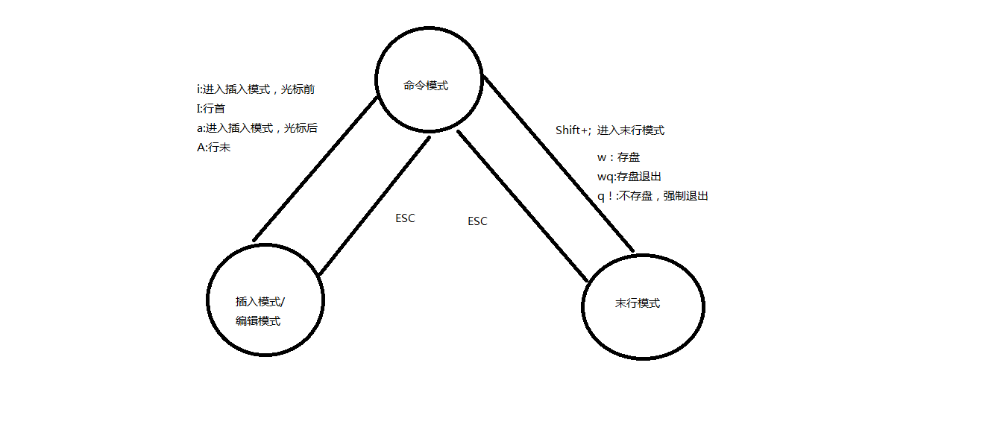

# Python 全栈文档

## 第六章  Linux编辑器vim

   1.xhell连接

​       xshell连接不上提示port22，网上办法不管用时可以vmware虚拟机选择编辑-虚拟网络设置-还原默认设置-进入虚拟机linux输入ifconfig查看网卡ip（ens33下的inet后面就是linux网卡ip）（输入ifconfig提示找不到此命令时是因为mini系统未安装此组件，输入yum -y install net-tools安装）

​     新建xshell连接，名称随便起，主机输入刚刚ip地址，用户名密码输入后点连接-接受并保存。

​    <font color='red'> 也有可能是ip地址冲突，断开连接后ip变了，重新输入ifconfig或ip addr，查看linux的ip，修改就好了。 </font>

  2.命令模式快捷键：

<font color='red'>ctrl+u 删除光标处至命令行结尾</font>
<font color='red'>ctrl+k 删除光标处至命令行结尾</font>
<font color='red'>ctrl+a 光标移动到最前面</font>  
<font color='red'>ctrl+e 光标移动到最后面</font> ，ctrl+z 关闭当前运行程序，也可用kill 9+进程id

命令模式按方向键可以切换历史命令，可以按<font color='red'> ctrl+r搜索命令，例如此时输入sys，就可以查看输入的含sys的命令 </font>

vim命令模式：home（0）、end（$)调整到行首行尾。G到文件末尾，nG到第n行。

vim编辑：输入vim后输入i/I/a/A进入插入模式，按esc退出到命令模式

vim退出：esc后按shift+：进入末行命令模式（两次esc退出），<font color='red'>输入w是保存，wq是保存退出，q!是不保存退出</font> 输入set nu显示行号，set nonu取消行号。<font color='red'> set ts=4设置Tab缩进为4个字符 </font>


## 第二章 VM与Linux安装

#### 1、vi与vim的简介

​         在Linux下，绝大部分的配置文件都是以ASCII码的纯文本形式存在的，可以利用一些简单的编辑软件修改配置。
​         在Linux命令行界面下的文本编辑器有很多，比如nano，Emacs，vim等。但是所有的UNIX Like系统都会内置vi文本编辑器，而其他的文本编辑器则不一定存在。很多软件的编辑接口都会主动调用vi，而且它的编辑速度相当快。因为有太多的<font color='red'> Linux命令都默认使用vi座位数据编辑的接口，所以我们必须学会vi ，</font>否则很多的命令无法操作。
​         vim可以视为vi的高级版本，<font color='red'>vim可以用颜色或者底线等方式显示一些特殊的信息</font>。vim可以根据文件的扩展名或者是文件内的开头信息判断该文件的内容而<font color='red'>自动调用该程序的语法判断式</font>。
​         概括的说：vi是文字处理器，而vim是它的升级版本，是一个程序开发工具。vim加入了许多额外的功能，例如支持正则表达式的查找架构，多文件编辑器，块复制等。

```bash
Vim是从 vi 发展出来的一个文本编辑器。代码补完、编译及错误跳转等方便编程的功能特别丰富，在程序员中被广泛使用。
简单的来说， vi 是老式的字处理器，不过功能已经很齐全了，但是还是有可以进步的地方。 vim 则可以说是程序开发者的一项很好用的工具。
连 vim 的官方网站 (http://www.vim.org) 自己也说 vim 是一个程序开发工具而不是文字处理软件。
既然是程序开发工具，那么就可以安装这个环境
[root@localhost ~]# yum install vim
已加载插件：fastestmirror
...省略...
中间提示是否继续或者OK选择 y 即可
```

​         基本上 vi/vim 共分为三种模式，

​         分别是**命令模式（Command mode）**，**输入（插入）模式（Insert mode）**和**末行命令模式（Last line mode）**

​         一般使用VI操作直接进入的模式，即默认模式。在此模式下可以进行的操作：移动光标、复制、粘贴、删除操作。



#### 2、命令模式

```bash
用户刚刚启动 vi/vim，便进入了命令模式。
此状态下敲击键盘动作会被Vim识别为命令，而非输入字符。比如我们此时按下i，并不会输入一个字符，i被当作了一个命令。
以下是常用的几个命令：
i           切换到输入模式，以输入字符。
x           删除当前光标所在处的字符。
shift + :   切换到末行命令模式，以在最底一行输入命令。
```

​         任何时候，不管用户处于何种模式，只要按一下ESC键，即可使Vi进入命令模式；我们在shell环境(提示符为$)下输入启动Vi命令，进入编辑器时，也是处于该模式下。在该模式下，用户可以输入各种合法的Vi命令，用于管理自己的文档。此时从键盘上输入的任何字符都被当做编辑命令来解释，若输入的字符是合法的Vi命令，则Vi在接受用户命令之后完成相应的动作。但需注意的是，所输入的命令并不在屏幕上显示出来。若输入的字符不是Vi的合法命令，Vi会响铃报警。

（注意：若想要编辑文本：<font color='red'>启动Vim，进入了命令模式，按下i，切换到输入模式</font>。命令模式只有一些最基本的命令，因此仍要依靠底线命令模式输入更多命令。）5

| 移动光标的方法                            |                                                              |
| :---------------------------------------- | ------------------------------------------------------------ |
| h 或 向左箭头键(←)                        | 光标向左移动一个字符                                         |
| j 或 向下箭头键(↓)                        | 光标向下移动一个字符                                         |
| k 或 向上箭头键(↑)                        | 光标向上移动一个字符                                         |
| l 或 向右箭头键(→)                        | 光标向右移动一个字符                                         |
| <font color='red'>"30j" 或 "30↓" </font>  | <font color='red'>向下移动30行</font>                        |
| [Ctrl] + [f]                              | 屏幕『向下』移动一页，相当于 [Page Down]按键 (常用)          |
| [Ctrl] + [b]                              | 屏幕『向上』移动一页，相当于 [Page Up] 按键 (常用)           |
| [Ctrl] + [d]                              | 屏幕『向下』移动半页                                         |
| [Ctrl] + [u]                              | 屏幕『向上』移动半页                                         |
| +                                         | 光标移动到非空格符的下一行                                   |
| -                                         | 光标移动到非空格符的上一行                                   |
| n<space>                                  | 那个 n 表示『数字』，例如 20 。按下数字后再按空格键，光标会向右移动这一行的 n 个字符。例如 20<space> 则光标会向后面移动 20 个字符距离。 |
| <font color='red'>0 或功能键[Home]</font> | 这是数字『 0 』：<font color='red'>移动到行首字符处</font> (常用) |
| <font color='red'>$ 或功能键[End]</font>  | <font color='red'>移动到行尾字符处(常用)</font>              |
| H                                         | 光标移动到这个屏幕的最上方那一行的第一个字符                 |
| M                                         | 光标移动到这个屏幕的中央那一行的第一个字符                   |
| L                                         | 光标移动到这个屏幕的最下方那一行的第一个字符                 |
| <font color='red'>G</font>                | <font color='red'>移动到这个档案的最后一行(常用)</font>      |
| nG                                        | n 为数字。移动到这个档案的第 n 行。例如 20G 则会移动到这个档案的第 20 行(可配合 :set nu) |
| <font color='red'>gg</font>               | <font color='red'>移动到这个档案的第一行</font>，相当于 1G 啊！ (常用) |
| n<Enter>                                  | n 为数字。光标向下移动 n 行(常用)                            |

| 搜索替换                       |                                                              |
| :----------------------------- | :----------------------------------------------------------- |
| <font color='red'>/word</font> | <font color='red'>寻找光标之下名称为 word 的字符串</font>。按n继续向下搜索 |
| <font color='red'>?word</font> | <font color='red'>寻找光标之上名称为 word 的字符串</font>。ann继续向上搜索 |
| n                              | 使用 /word 配合 n 及 N 是非常有帮助的！可以让你重复的找到一些你搜寻的关键词！ |
| N                              | 这个 N 是英文按键。与 n 刚好相反，为『反向』进行前一个搜寻动作。 例如 /vbird 后，按下 N 则表示『向上』搜寻 vbird 。 |

| 删除、复制       与贴上              |                                                              |
| :----------------------------------- | ------------------------------------------------------------ |
| <font color='red'>x, X</font>        | <font color='red'>x 为向后删除一个字符 (相当于 [del] 按键)， X 为向前删除一个字符(相当于 [backspace] 亦即是退格键) (常用)</font> |
| nx                                   | n 为数字，连续向后删除 n 个字符。举例来说，我要连续删除 10 个字符， 『10x』。 |
| <font color='red'>dd</font>          | <font color='red'>删除整行(</font>光标处常用)                |
| <font color='red'>ndd</font>         | <font color='red'>删除光标的向下 n 行</font>，例如 20dd 则是删除 20 行 (常用) |
| d1G                                  | 删除光标所在到第一行的所有数据                               |
| dG                                   | 删除光标所在到最后一行的所有数据                             |
| <font color='red'>d$</font>（home）  | <font color='red'>删除游标所在处到行尾</font>                |
| <font color='red'>d0</font>（end）   | <font color='red'>删除游标所在处到行首</font>                |
| <font color='red'>yy 类似dd</font>   | 复制游标所在的那一行(常用)                                   |
| <font color='red'>nyy 类似ndd</font> | n 为数字。复制光标所在的向下 n 行，例如 20yy 则是复制 20 行(常用) |
| y1G                                  | 复制游标所在行到第一行的所有数据                             |
| yG                                   | 复制游标所在行到最后一行的所有数据                           |
| <font color='red'>y0（home）</font>  | 复制光标所在的那个字符到该行行首的所有数据                   |
| <font color='red'>y$（end）</font>   | 复制光标所在的那个字符到该行行尾的所有数据                   |
| <font color='red'>p, P</font>        | p 为光标处向下粘贴，P 则为向上粘贴！ 不会覆盖原数据 (常用)   |
| J                                    | 将光标所在行与下一行的数据结合成同一行                       |
| c                                    | 重复删除多个数据，例如向下删除 10 行，[ 10cj ]               |
| <font color='red'>u</font>           | <font color='red'>撤销前一个动作。(常用)</font>              |
| [Ctrl]+r                             | 取消刚刚的撤销。(常用)                                       |
| <font color='red'>ndw</font>         | <font color='red'>删除光标后n个单词</font>                   |
| .                                    | 不要怀疑！这就是小数点！意思是重复前一个动作的意思。 如果你想要重复删除、重复贴上等等动作，按下小数点『.』就好了！ (常用) |


#### 3、输入模式

​         在命令模式下按下i就进入了输入模式。

​         在命令模式下输入插入命令i、附加命令a 、打开命令o、修改命令c、取代命令r或替换命令s都可以进入文本输入模式。在该模式下，用户输入的任何字符都被Vi当做文件内容保存起来，并将其显示在屏幕上。在文本输入过程中，若想回到命令模式下，按键ESC即可

| 进入输入或取代的编辑模式 | 进入输入模式(Insert mode)                                    |
| :----------------------- | ------------------------------------------------------------ |
| i, I                     | <font color='red'>i 为『光标处输入』， I 为『光标行首（非空格）输入』。 (常用)</font> |
| a, A                     | <font color='red'>a 为『光标后输入』， A 为『光标行尾输入』。(常用)</font> |
| o, O                     | <font color='red'>o 为『在光标下行输入新的一行』</font>； O 为光标上一行输入新的一行！(常用) |
| r, R                     | 进入取代模式(Replace mode)： r 只会取代光标所在的那一个字符一次；R会一直取代光标所在的文字，直到按下 ESC 为止；(常用) |
|                          | 上面这些按键中，在 vi 画面的左下角处会出现『--INSERT--』或『--REPLACE--』的字样。 |
| [Esc]                    | 退出编辑模式，回到一般模式中(常用)                           |


4、**末行模式**

​         末行模式也称ex转义模式。在命令模式下，用户按“:”键即可进入末行模式下，此时Vi会在显示窗口的最后一行(通常也是屏幕的最后一行)显示一个“:”作为末行模式的提示符，等待用户输入命令。多数文件管理命令都是在此模式下执行的(如把编辑缓冲区的内容写到文件中等)。末行命令执行完后，Vi自动回到命令模式。例如：

```
:sp newfile 双开编辑文件。bn是下一个文件，bp是上一个文件，可用于两个文件复制粘贴
```

​         则分出一个窗口编辑newfile文件。如果要从命令模式转换到编辑模式，可以键入命令a或者i；如果需要从文本模式返回，则按Esc键即可。在命令模式下输入“:”即可切换到末行模式，然后输入命令。

| 指令行的储存、离开等指令                          |                                                              |
| :------------------------------------------------ | ------------------------------------------------------------ |
| :w                                                | 将编辑的数据写入硬盘档案中(常用)                             |
| :w!                                               | 若文件属性为『只读』时，强制写入该档案。不过，到底能不能写入， 还是跟你对该档案的档案权限有关啊！ |
| :q                                                | 离开 vi (常用)                                               |
| <font color='red'>:q!</font>                      | <font color='red'>强制修改不保存。</font>                    |
|                                                   | 注意一下啊，那个惊叹号 (!) 在 vi 当中，常常具有『强制』的意思～ |
| <font color='red'>:wq</font>                      | <font color='red'>储存后离开，若为 :wq! 则为强制储存后离开 (常用)</font> |
| <font color='red'>命令模式下敲ZZ</font>           | 这是大写的 Z 喔，保存退出                                    |
| <font color='red'>命令模式下敲ZQ</font>           | 不保存，强制退出。效果等同于 **:q!**。                       |
| :w [filename]                                     | 将编辑的数据储存成另一个档案（类似另存新档）                 |
| :r [filename]                                     | 在编辑的数据中，读入另一个档案的数据。亦即将 『filename』 这个档案内容加到游标所在行后面 |
| :n1,n2 w [filename]                               | 将 n1 到 n2 的内容储存成 filename 这个档案。                 |
| <font color='red'>:!  命令</font>                 | <font color='red'>命令模式下执行 ！后的命令 显示结果！（此时会暂时退出vim文件编辑界面）</font> |
| :n1,n2s/word1/word2/gi</                          | n1 与 n2 为数字。在第 n1 与 n2 行之间寻找 word1 这个字符串，并将该字符串取代为 word2 ！举例来说，在 100 到 200 行之间搜寻 vbird 并取代为 VBIRD 则： 『:100,200s/vbird/VB/gi』。(常用)i为忽略大小写 |
| **:1,$s/word1/word2/g** 或 **:%s/word1/word2/gc** | <font color='red'>全文件替换 word1 字符串为 word2 ！c为确认(常用)</font> |

| vim 环境的变更                    |                                                        |
| :-------------------------------- | ------------------------------------------------------ |
| :set nu                           | 显示行号。要永久生效时可在/etc/vimrc中空白行写入set nu |
| :set nonu                         | 与 set nu 相反，为取消行号！                           |
| 普通用户：默认自动使用vim替换了vi |                                                        |

#### 4、vim 中批量添加注释

方法一 ：块选择模式

批量注释：

**Ctrl + v** 进入块选择模式，然后移动光标选中要注释的行，再按大写的 **I** 进入行首插入模式，输入注释符号如 **//** 或 **#**，按两下 **ESC**，**Vim** 会自动将你选中的所有行首都加上注释，保存退出完成注释。

取消注释：

**Ctrl + v** 进入块选择模式，选中你要删除的行首的注释符号，注意 **//** 要选中两个，选好之后按 **d** 即可删除注释，**ESC** 保存退出。

方法二: 替换命令

批量注释。

使用下面命令在指定的行首添加注释。

使用名命令格式： **:起始行号,结束行号s/^/注释符/g**（注意冒号）。

取消注释：

使用名命令格式： **:起始行号,结束行号s/^注释符//g**（注意冒号）。

例子：

1、在 10 - 20 行添加 **//** 注释

```
:10,20s#^#//#g
```

2、在 10 - 20 行删除 **//** 注释

```
:10,20s#^//##g
```

3、在 10 - 20 行添加 **#** 注释

```
:10,20s/^/#/g
```

4、在 **10 - 20** 行删除 # 注释

```
:10,20s/#//g


```

1.批量安装python库先在cmd输入 pip freeze > requirements.txt ，导出windows安装的库名列表

2.创建自己存放下载的安装包的路径

```shell
mkdir /tmp/outline_requirements_packages(路径自定义
```

3. 使用个国内源下载项目依赖包,通过`-i` 可以替换国内源, 

   pip3 download -d /tmp/outline_requirements_packages -r requirements.txt -i https://pypi.tuna.tsinghua.edu.cn/simple

4. 输入pip3 wheel -w /tmp/outline_requirements_packages -r requirements.txt 执行安装wheel文件

5. <font color='red'> annoy安装 </font>失败是需要升级gcc，见csdn收藏

   是由于c++库版本问题导致执行失败，解决办法更新gcc，更新gcc方式有许多帖子讲的过于复杂，建议参考：
   stackoverflow上关于升级gcc方式
   核心命令如下：

   yum install centos-release-scl
   yum install devtoolset-7-gcc*
   scl enable devtoolset-7 bash
   which gcc
   gcc --version
   升级完gcc后重新安装即可，祝大家学习和使用愉快！！！