# Python 全栈文档

## 第八章  Linux快照与克隆

#### 1、快照

​           **什么是快照**：创建一个备份。当执行了不可逆的错误操作后,可以通过快照用来恢复系统

​           **创建快照的三种模式**：

​                      挂载状态下创建快照

​                      开机状态下创建快照

​                      关机状态下创建快照

​           **创建快照**

​                      (1)点击管理快照

​                      (2)点击拍摄快照

​                      (3)输入名称信息

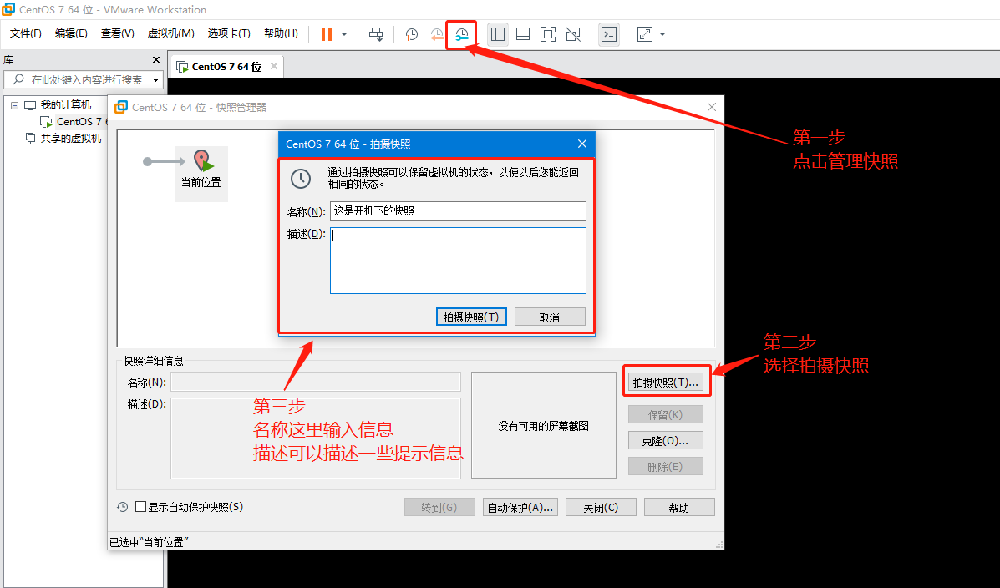

​                      (4)当需要转到创建好的快照，我们可以点击对应状态的快照

​                      (5)当点击转到即后选择是即可转到对应快照下

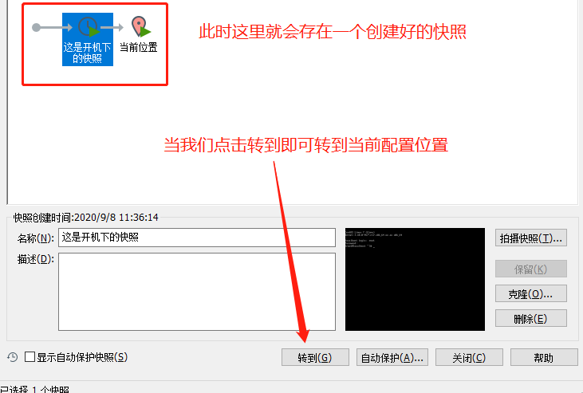

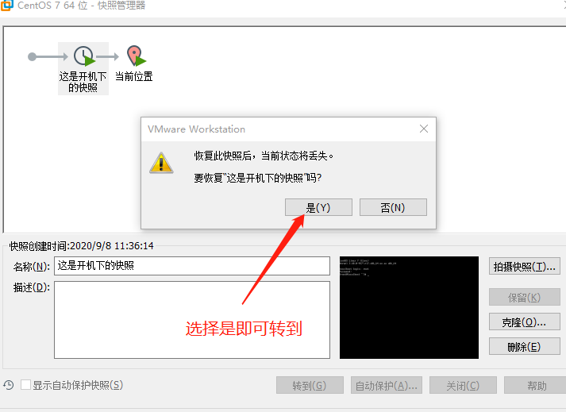

#### 2、克隆

​           **什么是克隆**：以某虚拟机为母版,复制出一个一模一样的虚拟机出来,包括里面的数据

​           **创建快照的模式**：需要在系统关机状态下操作（shutdown或者init 0）

​           **创建克隆**（<font color='red'>如果克隆后的系统无法开机</font>，可以在windows服务里开启所有的VMware服务）

​           正常选择通过快照创建克隆(**只能是关机状态下的克隆**)

​         关机命令：<font color='red'> （克隆后的linux系统需要改一个新的主机名，以便区分） </font>在网络那一节有写修改主机名

```bash
1、halt   立刻关机 

2、poweroff  立刻关机 

3、shutdown -h now 立刻关机(root用户使bai用) 

4、shutdown -h 10 10分钟du后自动关机 如果是通过shutdown命令设置关机的话zhi，可以用shutdown -c命令取消重启
```

​                      (1) 选择关机状态下的快照

​                      (2) 点击克隆

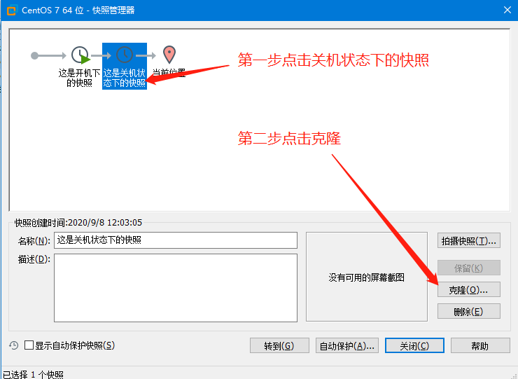

​                      (3) 点击下一步

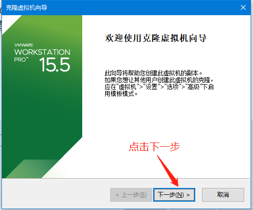

​                      (4) 选择现有快照，选择这是关机状态下的快照

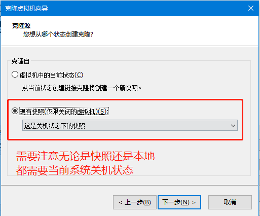

​                      (5) 选择创建完整克隆（更安全）

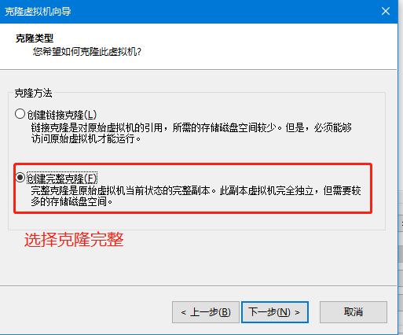

​                      (6) 设置好虚拟机服务器名称，注意和原服务器区分。尽量不重复

​                      (7) 找到对应的克隆位置

​                      (8) 点击完成

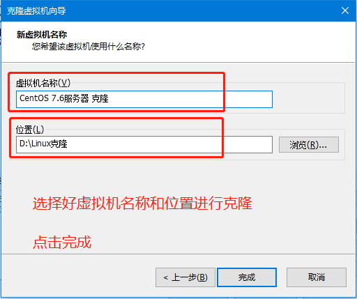

​                      (9) 正在克隆

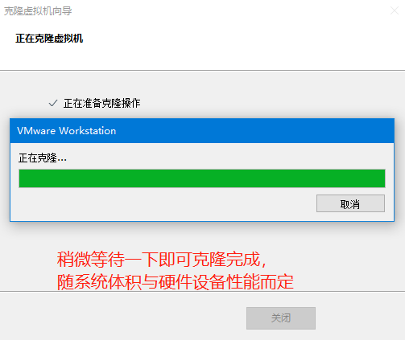

​                      (10) 等待克隆完成

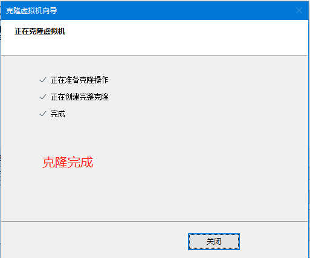

​                      (11) 克隆完成后显示，存在克隆服务器

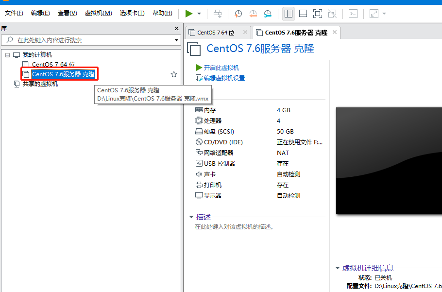